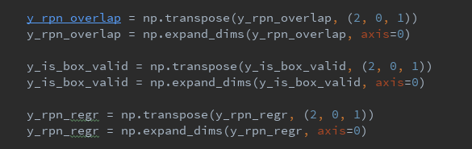

# Faster RCNN traps



* Batch size：

1. y\_rpn\_overlap: 每个Anchor与bbox的overlap是否超过70%（每个anchor是否为Positive）
2. y\_is\_box\_valid: 记录这个anchor是否为被选中的anchor（positive被选中/negative被选中）
3. y\_rpn\_regr:每个被选中的Anchor 相对于bbox 的偏移量（4个数值）

       这里每个变量都要在前面扩展一维。是因为keras 最后的output 最高维的size 是batch size。而对于faster rcnn 来说，每张图大小不一致。所作的resize 仅仅是把**最小边resize 成600**，保证最后的VGG16输出大小最小边约等于~40。然而，按最小边resize 成600的比例，缩放最长边，则最长边的比例也是不一致的，所以**最后image 输入不能把不一致大小的图片concat 到一起**，进行batch 输出。在源代码中，仅仅支持single batch 的训练。

