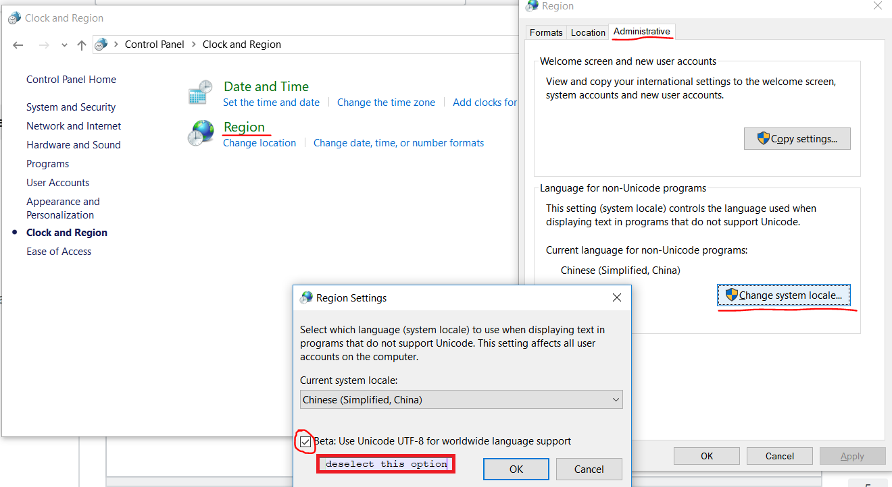

# Fatal Python error: Py\_Initialize: can't initialize sys standard streams LookupError: unknown encodi

If you met this problem, 

> ```text
> ......
> Following error message appears
> Fatal Python error: Py_Initialize: can't initialize sys standard streams
> LookupError: unknown encoding: 65001
> ......
> ```

This should be your system setting problem.

> Codepage 65001 is broken for non-ASCII input \(via ReadFile/ReadConsoleA\) in all versions of Windows that I've tested, including Windows 10.



